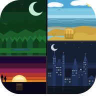
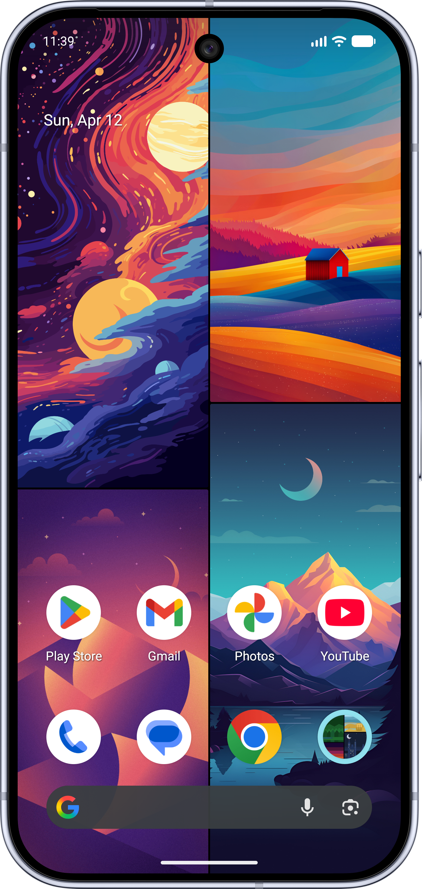
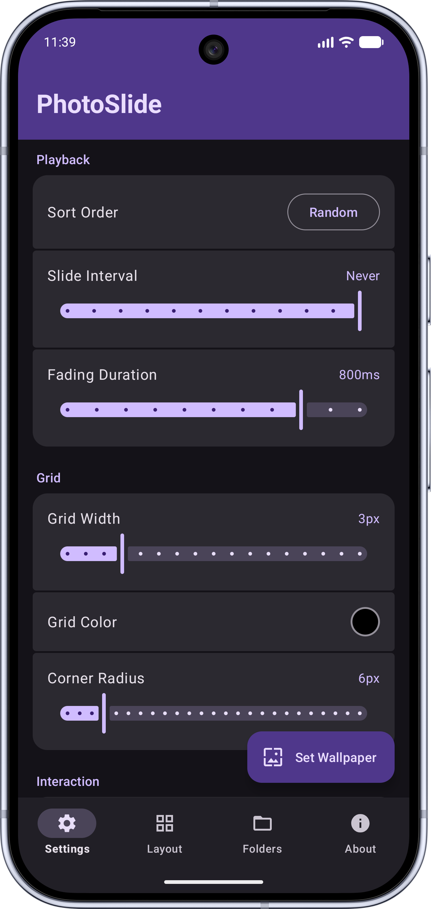
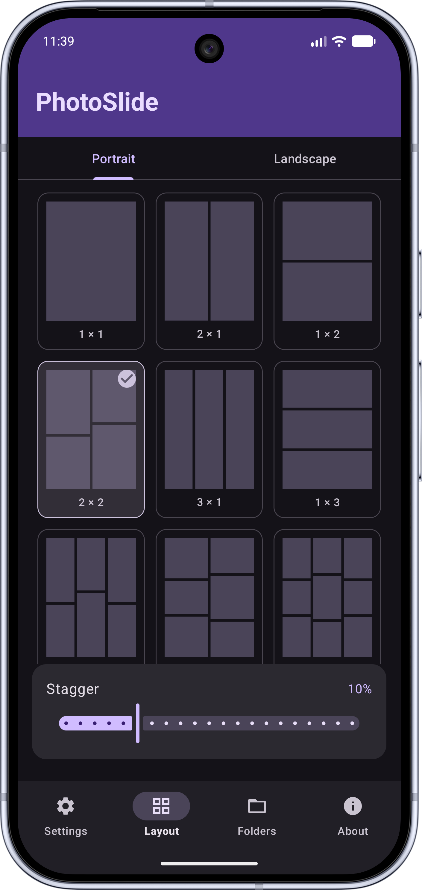
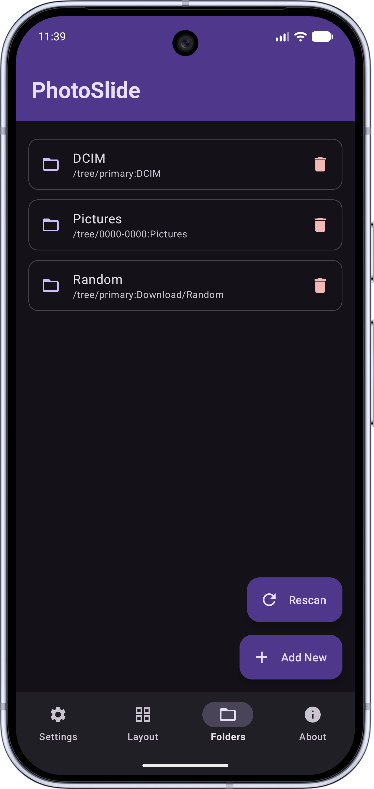

# PhotoSlide

PhotoSlide is an Android live wallpaper that turns your photo library into a dynamic, tiled wallpaper. Pick folders from your device, choose a grid layout, and let your pictures fill the screen — automatically sliding to fresh ones at your chosen interval.

 

## Features

### 🖼️ Wallpaper
- **Photo grid** — display your photos in a customisable grid directly on your homescreen
- **Portrait & landscape layouts** — set independent grid configurations for each orientation (1×1 up to 3×3)
- **Stagger effect** — offset alternating columns for a dynamic, magazine-style look
- **Fading duration** — configure crossfade time between 0 ms (instant) and 1000 ms per photo swap
- **Placeholder grid** — four Material You tonal shades shown while images are loading

### 🧠 Smart Features
- **Faces Only** — scans your library for photos containing faces and limits the wallpaper to those; results are cached and survive reboots
- **Center Faces** — automatically pans each photo so detected faces are centred on screen

### 📁 Library
- **Folder selection** — choose any folder (including subfolders) from your device storage
- **Sort options** — sort by name, date, or shuffle randomly
- **Slide interval** — photos cycle automatically at a configurable interval, or never
- **Double-tap to advance** — tap any photo on the wallpaper to replace it immediately
- **Rescan button** — manually trigger a fresh folder scan from the Folders tab without restarting the wallpaper

### 🎨 Appearance
- **Corner radius** — round photo corners from sharp to fully circular with fine-grained control
- **Grid colour** — choose the background colour shown between images
- **Spacing** — add or remove gaps between photos in the grid
- **Light & dark mode** — fully supports system-wide light and dark theme
- **Material You theming** — header and status bar use your device's dynamic colour palette

## Screenshots

<table>
  <tr>
    <td></td>
    <td></td>
    <td></td>
    <td></td>
    <td></td>
  </tr>
</table>

## Privacy

| | |
|---|---|
| 🚫 No tracking | No analytics, no crash reporting, no telemetry of any kind |
| 🚫 No ads | No advertising SDKs or networks of any kind |
| 🚫 No permissions | No storage, location, or network permissions required |
| 🚫 No logging | Nothing is recorded or stored outside your own device |
| ✅ 100% offline | No internet connection required or used — ever |

## Requirements

- Android 10 (API 29) or higher

## Setup

1. Install the app
2. Open **PhotoSlide Settings** and add one or more photo folders under **Folders**
3. Adjust the grid layout and slide interval to your liking
4. Tap **Set Wallpaper** to apply it as your live wallpaper
