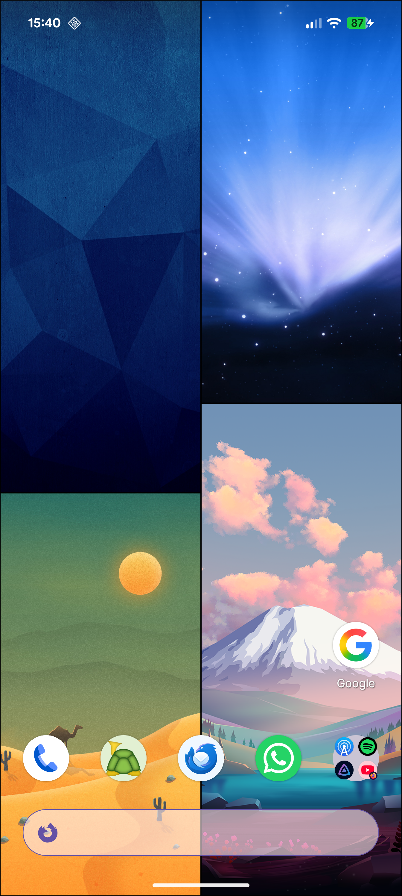
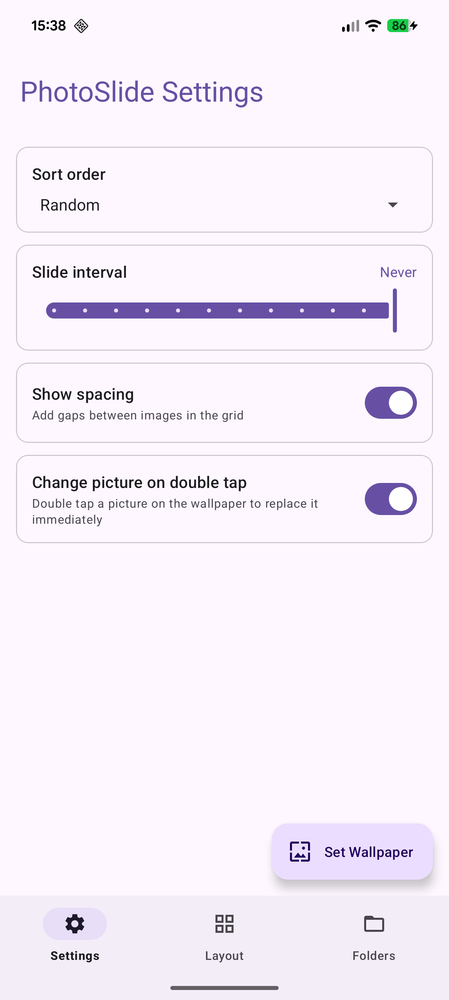
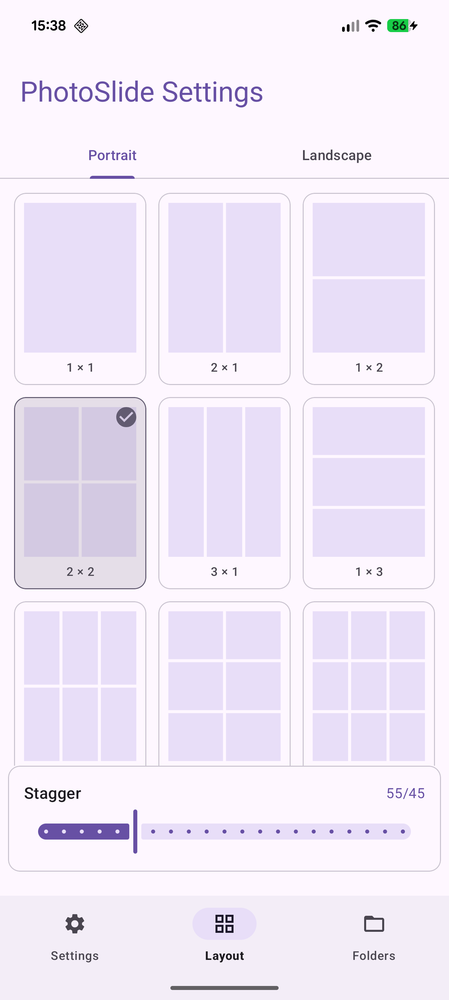
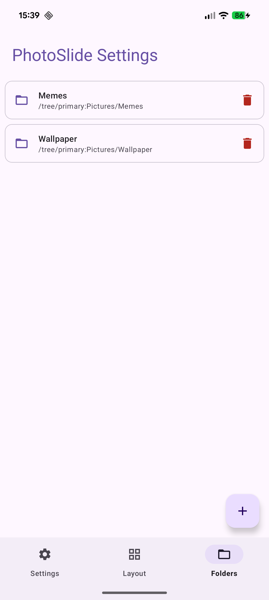

# PhotoSlide

PhotoSlide is an Android live wallpaper that turns your photo library into a dynamic, tiled wallpaper. Pick folders from your device, choose a grid layout, and let your pictures fill the screen — automatically sliding to fresh ones at your chosen interval.

## Features

- **Photo grid wallpaper** — display your photos in a customisable grid directly on your homescreen
- **Portrait & landscape layouts** — set independent grid configurations for each orientation (1×1 up to 3×3)
- **Stagger effect** — offset alternating columns for a dynamic, magazine-style look
- **Folder selection** — choose any folder (including subfolders) from your device storage
- **Sort options** — sort by name, date, or shuffle randomly
- **Slide interval** — photos cycle automatically at a configurable interval, or never
- **Double-tap to advance** — tap any photo on the wallpaper to replace it immediately
- **Spacing toggle** — add or remove gaps between photos in the grid

## Screenshots

  
  
  
  

## Requirements

- Android 10 (API 29) or higher

## Setup

1. Install the app
2. Open **PhotoSlide Settings** and add one or more photo folders under **Folders**
3. Adjust the grid layout and slide interval to your liking
4. Tap **Set Wallpaper** to apply it as your live wallpaper
